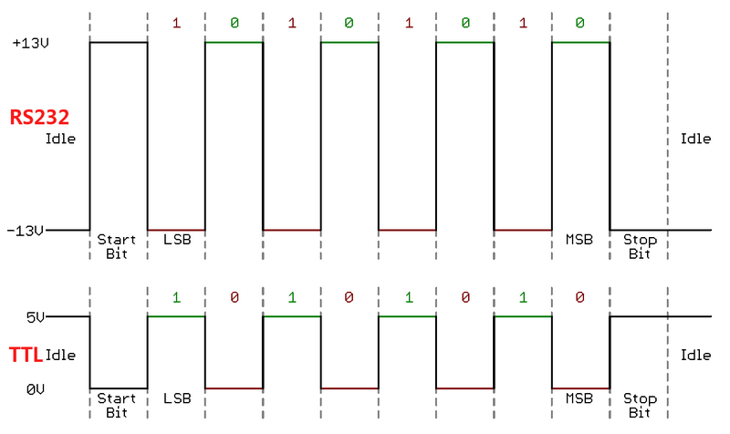

# Maxon Arduino Library

## Introduction

This repository is a custom Arduino Library for controlling maxon motors with epos4 via an RS232 communication. 
This library was written by Axel Juaneda to control the maxons of the gimbal for the Icarus project. 

The library was written using the following documentation:
- [EPOS4 UART Commanding](https://support.maxongroup.com/hc/fr/article_attachments/360018969133)
- [EPOS4 Communication Guide](https://www.maxongroup.com/medias/sys_master/root/8834324922398/EPOS4-Communication-Guide-En.pdf)
- [EPOS Studio](https://www.maxongroup.com/fr-ch/entrainements-et-systemes/commandes/commandes-de-positionnement) for registers values

The implemented functionalities are limited to Icarus's needs but can easily be extended.

## Hardware setup
What you need:
- Maxon EPOS4 controller
- RS232 to TTL adapter (for Arduino connection)
- Arduino board (e.g., Arduino Uno, Mega, Due)
- DC motor connected to the EPOS4
- Power supply for motor + controller

### What is RS232
RS232 is a long-established serial communication standard that defines how devices exchange data over a physical link. It specifies both the electrical voltage levels and the data frame format needed for reliable communication. Unlike logic-level serial signals, RS232 operates with higher positive and negative voltages (typically between ±3 V and ±15 V), which makes it more robust against noise and suitable for longer cable runs in industrial or laboratory environments.

At its core, RS232 uses the same data frame pattern as a UART, but with different voltage levels. This makes it practical to interface RS232 devices with microcontrollers like Arduino, since the UART protocol is natively supported — for example, when you call Serial.println(), you are directly using the UART hardware. Moreover because UART is asynchronous, it does not require a shared clock line, which allows simple and non-blocking read/write implementations.

Since the Arduino’s UART pins operate at logic levels (typically 5 V or 3.3 V), they cannot be connected directly to an RS232 interface such as the one on the EPOS4. The RS232 voltage levels (±3 V to ±15 V) would damage the microcontroller if applied directly. To bridge this gap, a dedicated RS232 transceiver is required, acting as a translator between the two standards.

### EPOS4 Overview

### Wring example

## EPOS4 library description
### High Level Functions
### Low Level Functions
