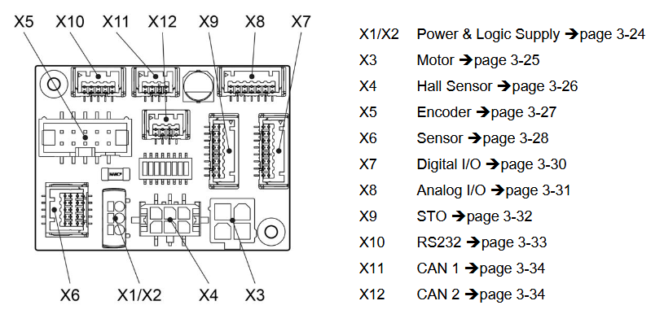
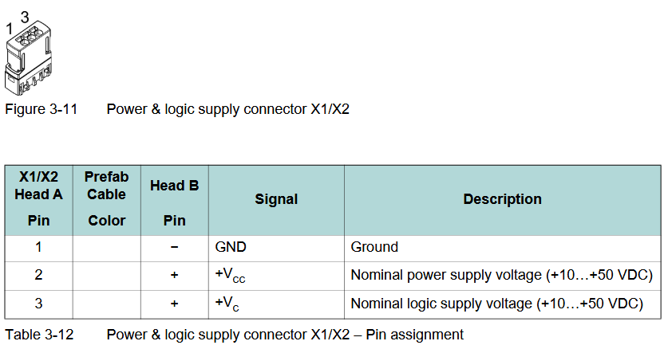
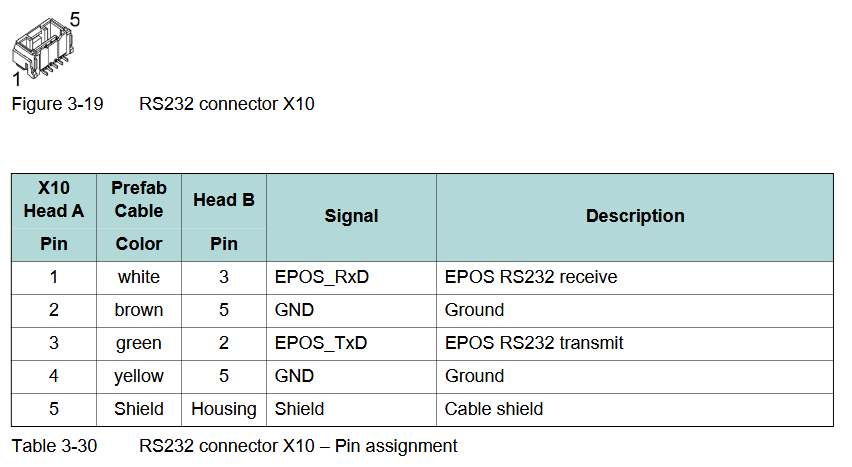

# Maxon Arduino Library

## Introduction

This repository is a custom Arduino Library for controlling maxon motors with epos4 via an RS232 communication. 
This library was written by Axel Juaneda to control the maxons of the gimbal for the Icarus project of the EPFL Rocket Team. 

The library was written using the following documentation:
- [EPOS4 UART Commanding](https://support.maxongroup.com/hc/fr/article_attachments/360018969133) (low level UART packet format)
- [EPOS4 Communication Guide](https://www.maxongroup.com/medias/sys_master/root/8834324922398/EPOS4-Communication-Guide-En.pdf)
- [EPOS4 Application Notes](https://www.maxongroup.com/medias/sys_master/root/8837359304734/EPOS4-Application-Notes-Collection-En.pdf) (commanding register sequences)
- [EPOS4 Compact 50/5 Hardware Reference](https://www.maxongroup.net.au/medias/sys_master/8828280078366.pdf) (for epos pin out)
- [EPOS Studio](https://www.maxongroup.com/fr-ch/entrainements-et-systemes/commandes/commandes-de-positionnement) for registers values

Currently, the implemented functionalities are limited to Icarus’s needs, with support for **current threshold homing** and **profile position homing**. However, the library is designed to be easily extendable, allowing additional features to be integrated as needed.

## Hardware setup
What you need:
- Maxon EPOS4 controller
- RS232 to TTL adapter (for Arduino connection)
- Arduino board (e.g., Arduino Uno, Mega, Due)
- DC motor connected to the EPOS4
- Power supply for motor + controller

### What is RS232
RS232 is a long-established serial communication standard that defines how devices exchange data over a physical link. It specifies both the electrical voltage levels and the data frame format needed for reliable communication. Unlike logic-level serial signals, RS232 operates with higher positive and negative voltages (typically between ±3 V and ±15 V), which makes it more robust against noise and suitable for longer cable runs in industrial or laboratory environments.

At its core, RS232 uses the same data frame pattern as a UART, but with different voltage levels. This makes it practical to interface RS232 devices with microcontrollers like Arduino, since the UART protocol is natively supported — for example, when you call Serial.println(), you are directly using the UART hardware. Moreover because UART is asynchronous, it does not require a shared clock line, which allows simple and non-blocking read/write implementations.


Since the Arduino’s UART pins operate at logic levels (typically 5 V or 3.3 V), they cannot be connected directly to an RS232 interface such as the one on the EPOS4. The RS232 voltage levels (±3 V to ±15 V) would damage the microcontroller if applied directly. To bridge this gap, a dedicated RS232 transceiver is required, acting as a translator between the two standards.

### Wiring example
The following section shows a wiring example for controlling the epos4 with a teensy4.1. I used an epos4 compact 50/5, the RS232 connector is probably the same across epos4 versions. The epos4 compact 50/5 does not require a seperate power supply for the logic part of the controller, thus only one power supply is required, this may not be the case for other epos4.
Note that the power gnd and logic gnd are seperate, logic gnd must be connected to the Arduino gnd (RS232 is a 3 wire protocol !!!).

For convenience here is an extract of the [EPOS4 Compact 50/5 Hardware Reference](https://www.maxongroup.net.au/medias/sys_master/8828280078366.pdf).





# Installation

You can install this library in two different ways depending on your development environment.

## Method 1: Using PlatformIO

1. Navigate to your PlatformIO project folder.  
2. Inside your project, go to the `lib/` directory.  
3. Clone the repository into the `lib/` folder:

   ```bash
   git clone https://github.com/EPFLRocketTeam/2025_I_AV_SW_MAXON_ARDUINO.git

If your project itself is under version control (e.g., a GitHub repo), it is recommended to add the library as a git submodule instead.

4. Build your project. PlatformIO will automatically detect and include the library.

## Method 2: Using the Arduino IDE

1. Download the library as a ZIP file from the green Code → Download ZIP button.
2. Open the Arduino IDE.
3. Go to Sketch → Include Library → Add .ZIP Library….
4. Select the downloaded ZIP file.
5. The library will now be available under Sketch → Include Library in the Arduino IDE. It can be included as:

   ```bash
   #include <epos4.h>

## EPOS4 library description

The library is implemented in an asynchronous, non-blocking fashion. The core of this mechanism is the `tick()` function, which must be called as frequently as possible inside your main loop. Each call to `tick()` checks whether the EPOS4 has sent a response or if a new command needs to be issued. If no action is required, it immediately returns control to your code, allowing your application to remain responsive while still maintaining reliable communication with the motor controller.

A basic example can be found in the examples/BasicExample directory. It demonstrates how to use current treshold homing and Profile Position Mode (PPM).

### High Level Functions
### Low Level Functions

This section explains the **low-level abstraction** of the EPOS4 library, focusing on **how serial communication is implemented** to interact with the EPOS4 motor controller.

#### Overview

The low-level layer provides a **direct interface with the EPOS4 over UART**, handling:

- Serial frame construction and transmission
- CRC16 error checking
- Character stuffing (DLE duplication)
- Sending and receiving object dictionary read/write requests

It abstracts the **raw EPOS serial protocol** and ensures that higher layers can reliably read/write objects without handling communication details.

---

#### Serial Protocol

The EPOS4 uses a **Maxon-specific serial protocol** (based on CANopen frame concepts).  

##### Frame Structure

A typical **EPOS4 frame** has the following components:

| Field                 | Size           | Description |
|-----------------------|----------------|-------------|
| Start of Frame (DLE)  | 1 byte         | `0x90` – indicates start of frame |
| Start of Text (STX)   | 1 byte         | `0x02` – indicates frame payload begins |
| OpCode                 | 1 byte         | Command type (`0x60`=Read Object, `0x68`=Write Object) |
| Length                | 1 byte         | Number of data **words** in the frame payload |
| Data                  | N bytes        | Node ID, Index, Sub-index, Value (little-endian) |
| CRC Low/High          | 2 bytes        | CRC16 over OpCode + Data |
| Character Stuffing     | Variable       | Duplicate `0x90` bytes in the payload |

---

##### Character Stuffing

To avoid confusion with the DLE (`0x90`) start byte, any occurrence of `0x90` in the payload is **duplicated**:

```cpp
void EPOS4::addStuffedByte(std::vector<uint8_t> &frame, uint8_t byte) 
{
    frame.push_back(byte);
    if (byte == 0x90) frame.push_back(0x90);
}

